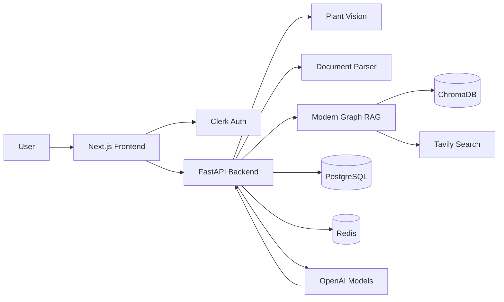
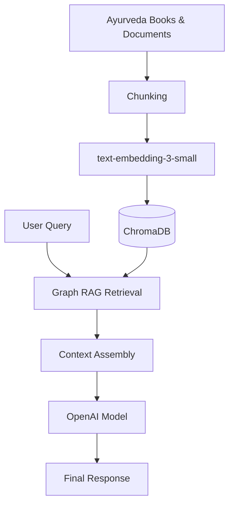
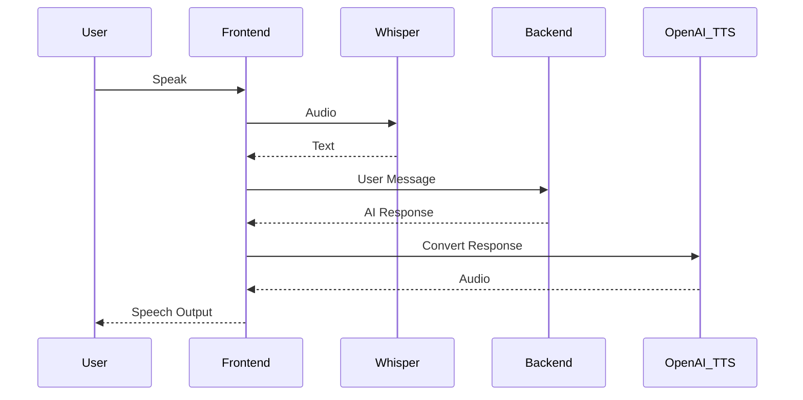

# 🌿 Vaidya AI

**AI-powered Ayurveda Assistant** with Modern Graph RAG, plant image recognition, document intelligence, voice interaction, and verified web search.

Vaidya AI helps users explore Ayurvedic knowledge through conversational AI powered by curated Ayurveda literature, retrieval-augmented generation (RAG), vision models, voice interfaces, and web verification.

---

# ✨ Features

## 🧠 Modern Graph RAG

* Knowledge retrieval using Modern Graph RAG architecture
* Semantic search across Ayurveda literature
* Context-aware answer generation
* Multi-document retrieval and ranking
* Source-grounded responses

## 🌱 Plant Identification

Upload plant images and receive:

* Plant identification
* Ayurvedic classification
* Traditional medicinal uses
* Related knowledge retrieval from Ayurveda sources

## 📄 Document Intelligence

Upload and analyze:

* PDF files
* Text documents
* Markdown files
* Prescription images
* Medicine packaging photos

The system extracts information and enriches responses using the RAG pipeline.

## 🔐 Authentication & Security

Powered by Clerk:

* Secure authentication
* JWT verification
* User session ownership enforcement
* Protected chat history
* Multi-user isolation

Users can only access their own:

* Chats
* Uploaded files
* Messages
* Sessions

## 🎙️ Voice AI

### Speech-to-Text

* Whisper-powered transcription
* Microphone input directly into chat

### Text-to-Speech

* OpenAI TTS
* Read assistant responses aloud
* Text responses remain visible

## 🌐 Verified Search

Tavily Search provides:

* Real-time web verification
* Additional evidence gathering
* Fresh information beyond local knowledge sources

## 💾 Persistent Storage

* PostgreSQL for chats and messages
* Redis for caching and performance
* ChromaDB for vector storage

---

# 🏗️ Technology Stack

| Layer            | Technology             |
| ---------------- | ---------------------- |
| Frontend         | Next.js                |
| Backend          | FastAPI                |
| Authentication   | Clerk                  |
| LLM              | OpenAI GPT Models      |
| Embeddings       | text-embedding-3-small |
| Speech-to-Text   | OpenAI Whisper         |
| Text-to-Speech   | OpenAI TTS             |
| Search Engine    | Tavily                 |
| Vector Database  | ChromaDB               |
| Database         | PostgreSQL             |
| Cache            | Redis                  |
| Containerization | Docker                 |

---

# 🧩 System Architecture



---

# 🔄 RAG Pipeline



---

# 🎙️ Voice Processing Flow



---

# 📁 Project Structure

```text
.
├── backend/
│   ├── app/
│   ├── requirements.txt
│   └── .env
│
├── fronteend-1/
│   ├── app/
│   ├── components/
│   ├── package.json
│   └── .env.local
│
├── data/
│   └── Ayurveda source documents
│
├── vector_store/
│   └── ChromaDB storage
│
├── docker-compose.yml
│
└── README.md
```

---

# 🚀 Getting Started

## Prerequisites

* Python 3.11+
* Node.js 18+
* Docker Desktop
* OpenAI API Key
* Clerk Account
* Tavily API Key

---

# Step 1 — Start Infrastructure

Only PostgreSQL and Redis run inside Docker.

```powershell
docker compose up -d
```

Services:

```text
PostgreSQL : localhost:5432
Redis      : localhost:6379
```

---

# Step 2 — Backend Setup

```powershell
cd backend

copy .env.example .env

.\.venv\Scripts\pip install -r requirements.txt

.\.venv\Scripts\python -m app.ingest_cli --clear --url-limit 0

.\.venv\Scripts\uvicorn.exe app.main:app --host 127.0.0.1 --port 5500 --reload
```

Backend URL:

```text
http://127.0.0.1:5500
```

---

# Step 3 — Frontend Setup

```powershell
cd fronteend-1

copy .env.local.example .env.local

npm install

npm run dev
```

Open the URL displayed by Next.js.

---

# 🔐 Authentication Configuration

## Frontend

```env
NEXT_PUBLIC_CLERK_PUBLISHABLE_KEY=

NEXT_PUBLIC_API_BASE_URL=http://127.0.0.1:5500
```

## Backend

```env
CLERK_ISSUER=

CLERK_AUDIENCE=

CLERK_JWKS_URL=
```

> `CLERK_JWKS_URL` can remain empty when `CLERK_ISSUER` is configured.

---

# 🧠 Knowledge Base

The knowledge base consists of:

* Ayurveda textbooks
* Classical Ayurvedic literature
* Research material
* Uploaded documents
* User-provided files

All content is embedded using:

```text
text-embedding-3-small
```

and stored in:

```text
ChromaDB
```

for semantic retrieval.

---

# 💬 Chat Features

* Automatic conversation naming
* Persistent history
* Context-aware memory
* File-aware conversations
* Multi-turn RAG responses
* User ownership validation

Chat flow:

```text
User Message
      ↓
Thinking State
      ↓
Assistant Response
```

---

# 📦 Infrastructure

Docker intentionally remains lightweight.

Containers:

```text
PostgreSQL
Redis
```

Run locally:

```text
FastAPI Backend
Next.js Frontend
```

This approach provides:

* Faster development
* Easier debugging
* Faster reload cycles
* Lower resource consumption

---

# 🔍 Search & Verification

Tavily is used for:

* Fact verification
* External information retrieval
* Additional evidence collection
* Real-time knowledge augmentation

---

# 🛡️ Security Model

Every request is validated using Clerk authentication.

Backend guarantees:

* Session ownership checks
* Chat ownership checks
* Upload ownership checks
* Message isolation between users

No user can:

* Access another user's chats
* View another user's files
* Delete another user's sessions
* Upload into another user's workspace

---

# 📜 License

This project is intended for educational, research, and healthcare-assistance purposes.

Medical information generated by the system should not replace professional medical advice, diagnosis, or treatment.
